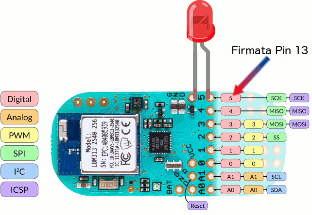

# BeanSerial Firmata example

This example lets you remote control a LightBlue Bean with firmata/nodejs.

*  Write [this firmata sketch](https://github.com/jacobrosenthal/arduino/blob/bean/examples/StandardFirmata/StandardFirmata.ino) onto the Bean using the Arduino IDE and the [Bean Getting Started Guide](http://punchthrough.com/bean/getting-started/).
*  Connect an LED to the Bean. (It's marked pin 5 on board, but it's pin 13 in firmata)
*  Run `npm install` in this directory.
*  Run `node index` in this directory.
*  Sit back and watch pin 13 toggle on and off.

## Note about the pin layout

The pins exposed to firmata are not the same as what are labeled on the board.
However your code can use this translation:

D5 = 13

D4 = 12

D3 = 11

D2 = 10

D0 & D1 are currently unavailable

A0 = A4 = 18

A1 = A5 = 19

